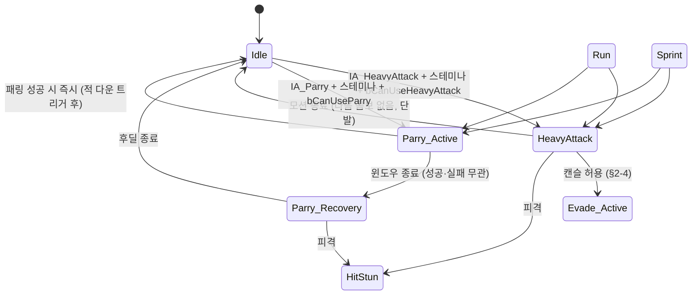

# SKILL_01B_UNLOCK_SPEC.md — Stage 1 클리어 후 해금 영역 상세 명세 (v2)

> **문서 우선순위:** `AI_AGENTS_GUIDE.md` §0 대원칙 > `AI_AGENTS_GUIDE.md` §2·§3 > `Design/GAME_DESIGN_PILLARS.md` v2 > `Design/SKILL_01_COMBAT_SPEC.md` v3 > 본 문서
> **상태:** P 2차 산출물 — KiHoon §11-Q1~Q7 답변 반영 완료 (2026-05-30) + D 조건부 Go surgical 보정 완료. D 재확인 대기
> **작성:** 에이전트 P (Claude Opus 4.7) · 2026-05-30 (v2)
> **선행 문서:** `Design/SKILL_01_COMBAT_SPEC.md` v3 (Stage 1 시작 액션), `Design/INPUT_MAPPING.md` (키 매핑 SSOT), `Design/GAME_DESIGN_PILLARS.md` v2 (§7-2 해금 진행표)
> **다음 산출물:** Stage 2 명세 (궁극기·불 기술), `Design/ENEMY_AI_*.md`

본 명세는 **Pillars §7-2 "Stage 1 클리어 후 해금"** 영역을 다룬다. SKILL_01 v3 확정값(상태 머신·입력 체계·자원 모델)은 본 명세에서 변경하지 않으며, **확장만** 수행한다. SKILL_01 v3와 충돌 시 v3가 우선이며 본 명세를 수정한다.

---

## 0. 범위 (Scope)

### 0-1. 포함 — Stage 1 클리어 후 해금 액션

- **강공격 (HeavyAttack)** — `IA_HeavyAttack` (RMB / RT). 단발 1타 (차징·콤보 미포함, KiHoon §11-Q4·Q5 결정 — 추후 논의, 단발 유지)
- **패링 (Parry)** — `IA_Parry` (**R / LT**, KiHoon §11-Q7 결정 2026-05-30), 단발 시도 액션
- **다운 반응 활용** — 강공격·패링 성공 시 적 `EGKHitReaction::Down` 트리거 → 추가타 윈도우

### 0-2. 비포함 — 후속 명세

| 항목 | 후속 산출물 | 비고 |
| :--- | :--- | :--- |
| 강공격 차징 (다크소울 R2 hold) | SKILL_01C 또는 본 명세 v2 | KiHoon 결정 필요 (§11-Q4) |
| 강공격 콤보화 (강공격 1·2타) | SKILL_01C 또는 v2 | KiHoon 결정 필요 |
| 패링 가드 자세(상시 hold) | 별도 명세 | 본 명세는 단발 패링만 |
| 궁극기(불 마법) | Stage 2 후속 | INPUT_MAPPING.md `IA_Ultimate(G)` 예약 |
| 적 다운 후 처형(Riposte) | 별도 명세 | Stage 1B 핵심 외 |
| Stage 1 클리어 트리거 게임 로직 | `AGKGameMode` 명세 (별도) | 본 명세는 해금 인터페이스만 정의 |

---

## 1. 해금 메커니즘 (Architecture)

### 1-1. 해금 인터페이스 — 단방향 set

본 명세는 **해금 시점 게임 로직을 정의하지 않는다.** Stage 1 클리어 조건·트리거 타이밍은 별도 `AGKGameMode` 명세에서 다룬다. 본 명세는 **AGKCharacter가 노출하는 해금 인터페이스**만 정의한다.

**런타임 플래그 (AGKCharacter):**

```cpp
UPROPERTY(VisibleAnywhere, BlueprintReadOnly, Category = "Combat|Unlock")
bool bCanUseHeavyAttack = false; // Stage 1 클리어 시 true 토글

UPROPERTY(VisibleAnywhere, BlueprintReadOnly, Category = "Combat|Unlock")
bool bCanUseParry = false; // 동일

UFUNCTION(BlueprintCallable, Category = "Combat|Unlock")
void SetUnlockHeavyAttack(bool bUnlocked);

UFUNCTION(BlueprintCallable, Category = "Combat|Unlock")
void SetUnlockParry(bool bUnlocked);
```

**설계 결정 (KiHoon 확정 2026-05-30):**
- **동시 해금 (KiHoon §11-Q1 결정).** Stage 1 클리어 시 두 플래그 모두 true 토글. Pillars §7-2 "Stage 1 클리어 후 해금"과 일관. 순차 해금 안 함.
- `Data Asset(EditDefaultsOnly)` 에 두지 **않는다.** 해금 상태는 런타임 진행 상태이며 Data Asset은 디자인 상수용. 충돌 방지.
- 본 데모는 세이브 시스템 없음(Pillars §10) → **사망 리스폰 시 해금 상태 유지** (KiHoon §11-Q2 결정). 다크소울 클래식과 다른 결정 — 페일런스 없이 단순 리스폰 후에도 해금 유지. 구체적 코드는 `AGKGameMode`가 리스폰 시 플래그 재설정하지 않음(또는 명시적 유지)로 책임 분담.

### 1-2. 입력 게이트 (해금 전 입력 차단)

입력 핸들러는 플래그를 먼저 검사하고 false면 입력 자체를 무시한다. 사일런트 드리프트 방지.

```cpp
void AGKCharacter::OnInputHeavyAttack()
{
    if (!bCanUseHeavyAttack) return; // 해금 전 무시
    if (!CanEnterHeavyAttack()) return; // 상태 게이트 (§4-3)
    if (!HasStaminaFor(HeavyAttackStamina)) return;
    EnterHeavyAttackState();
}

void AGKCharacter::OnInputParry()
{
    if (!bCanUseParry) return;
    if (!CanEnterParry()) return;
    if (!HasStaminaFor(ParryStamina)) return;
    EnterParryActiveState();
}
```

### 1-3. 클래스·자산 영향 요약 (v3 대비 변경)

| 자산 | 변경 | 비고 |
| :--- | :--- | :--- |
| `AGKCharacter` | 플래그 2개 + Setter 2개 + 입력 핸들러 2개 + 상태 전이 함수 추가 | v3 구조 유지, 확장만 |
| `EGKCombatState` | `HeavyAttack` / `Parry_Active` / `Parry_Recovery` 3상태 추가 | v3 11상태 → 14상태 |
| `UGKCombatConfig` | 강공격·패링 필드 묶음 추가 (§7-1) | 신규 카테고리 |
| `UGKPlayerStatsConfig` | **변경 없음** | HP·회복약 묶음 그대로 |
| `DT_ComboAttacks` | **변경 없음** | 지상 콤보 전용 유지 |
| `AGKEnemyCharacter` | `EGKHitReaction::Down` 활용 확대 (Sway 외 추가타 윈도우) | enum 자체는 v3에 이미 있음, 활용만 |
| 신규 DT | **신설하지 않음** (§7-3 결정 근거) | 강공격 단발이라 단일 필드로 충분 |

---

## 2. 상태 머신 확장 (State Machine)

### 2-1. 추가 상태 (v3 11상태 → 14상태)

| 상태 | 의미 | 이동 입력 | 다른 액션 입력 |
| :--- | :--- | :--- | :--- |
| `HeavyAttack` | 강공격 1타 모션 중 | 무시 (루트모션 또는 정지) | 회피만 캔슬 허용 (콤보와 동일 정책) |
| `Parry_Active` | 패링 윈도우 ON (적 공격 흡수 가능) | 무시 | 모든 입력 무시. 적 공격 도달 시 패링 성공 → 적 `Down` |
| `Parry_Recovery` | 패링 윈도우 OFF, 후딜 | 무시 | **회피(`IA_Evade`)만 캔슬 허용** (KiHoon §11-Q3 결정 2026-05-30) — 콤보·HeavyAttack과 동일 정책. §2-3·§4-3·§5-2 일관. 자원 곡선이 남발 방지(회피 22 > 패링 18, 회피 i-frame 0.45s) |

### 2-2. 상태 전이 다이어그램 (v3 다이어그램 확장)



> v3 다이어그램(SKILL_01 §2-3)과 합쳐서 봐야 한다. 본 §2-2는 **추가 전이만** 표시한다.

### 2-3. 캔슬·예외 규칙 (v3 §2-4 확장)

| 출발 상태 | 도착 상태 | 허용 | 비고 |
| :--- | :--- | :--- | :--- |
| `HeavyAttack` | `Evade_Active` | ✅ | 콤보와 동일 정책. 회피만 캔슬 허용 |
| `HeavyAttack` | `Parry_Active` | ❌ | 강공격 중 패링 진입 불가 |
| `HeavyAttack` | `Jump` | ❌ | v3 점프 상호배타 유지 |
| `HeavyAttack` | `Attack`(콤보) | ❌ | 단발이므로 콤보 캔슬 없음 |
| `Attack`(콤보) | `HeavyAttack` | ❌ | 콤보 중 강공격 캔슬 진입 불가. 콤보 종료 후 진입 |
| `Attack`(콤보) | `Parry_Active` | ❌ | 동일 |
| `Parry_Active` | 모든 액션 | ❌ | 윈도우 중 캔슬 불가 |
| `Parry_Recovery` | `Evade_Active` | ✅ | **회피 캔슬 허용 (KiHoon §11-Q3 결정, 2026-05-30).** 콤보·HeavyAttack과 동일 정책. 후딜 중 회피로 안전 이탈 가능. P 권장(불가)에서 KiHoon 정책 변경 — 자원 곡선(회피 22 > 패링 18)이 남발 방지 책임 |
| `Parry_Recovery` | `HitStun` | ✅ | 후딜 중 피격 가능 (회피 캔슬 못한 경우) |
| `Jump` / `JumpAttack` | `HeavyAttack` / `Parry_*` | ❌ | v3 점프 상호배타 유지 |
| `Heal` | `HeavyAttack` / `Parry_*` | ❌ | Heal 중 회피만 캔슬 가능(v3 §2-4) — 본 명세에서 변경 없음 |
| `Evade_Active` / `Evade_Recovery` | `HeavyAttack` / `Parry_*` | ❌ | v3 회피 정책 유지 |
| `HitStun` / `Death` | 모든 액션 | ❌ | v3 유지 |

### 2-4. v3 상태와 충돌 검토 (필수 항목)

| v3 상태 | 본 명세 추가 액션과 충돌? | 검토 결과 |
| :--- | :---: | :--- |
| `Idle` / `Run` / `Sprint` | 진입 출처로 활용 | OK — 강공격·패링 진입 경로 |
| `Attack` (콤보) | 캔슬 양방향 ❌ | OK — 콤보와 강공격은 별도 사이클 |
| `Evade_Active` / `Evade_Recovery` | 진입 불가 (v3 유지) | OK |
| `Heal` | 진입 불가 (v3 유지) | OK |
| `Jump` / `JumpAttack` | 상호배타 (v3 유지) | OK — 점프 중 강공격·패링 불가, 강공격·패링 중 점프 불가 |
| `HitStun` / `Death` | 전이 무관 (v3 유지) | OK |

**결론:** v3 상태와 충돌 없음. 본 명세는 14상태로 확장되며, 추가 3상태는 기존 11상태와 명확한 경계를 갖는다.

---

## 3. 자원 모델 — P 권장 수치 (KiHoon 빨간펜 가능)

> ⚠ 모든 수치는 `UGKCombatConfig` Data Asset 외부화. `.cpp` 매직 넘버 없음 (v3 원칙 유지).

### 3-1. 강공격 (`UGKCombatConfig`)

| 항목 | 권장값 | 필드 | 근거 |
| :--- | :--- | :--- | :--- |
| 데미지 | 60 | `HeavyAttack_Damage` | 콤보 3타 45보다 강. 단발이므로 콤보 누적(102)보다는 낮음. 1번 정확히 맞추는 가치 |
| 스테미나 | 35 | `Stamina_HeavyAttack` | 콤보 3타 28보다 큰 소모. 회피(22) 후엔 부족하게 — 자원 긴장 유지 |
| 모션 시간 | 1.2 s | `HeavyAttack_MotionDuration` | 콤보 3타(1.10s)보다 길게, 차징 느낌 묵직함 표현 |
| HitWindow | 0.40 ~ 0.70 s | `HeavyAttack_HitWindowStart`/`End` | 모션 중반·약간 늦게 — 예측 가능한 윈도우 |
| 적 반응 | **Down** | (코드 분기) | Pillars §6-2 — 강공격·콤보 마지막 타가 다운 트리거 |

### 3-2. 패링 (`UGKCombatConfig`)

| 항목 | 권장값 | 필드 | 근거 |
| :--- | :--- | :--- | :--- |
| Active 윈도우 | 0.20 s | `Parry_ActiveDuration` | 다크소울 작은 방패 패링 약 0.2s 정합. 좁아야 긴장감 |
| Recovery 후딜 | 0.50 s | `Parry_RecoveryDuration` | 패링 실패 시 페널티 보장. 회피(0.55s)와 유사 |
| 전체 모션 | 0.70 s | (합산) | Active 0.20 + Recovery 0.50 |
| 스테미나 | 18 | `Stamina_Parry` | 회피(22)보다 적음. 잦은 시도 허용 — 다만 실패 시 페널티 큼 |
| 패링 성공 시 적 반응 | **Down + 추가타 윈도우** | (코드 분기) | Pillars §6-2 |
| 추가타 윈도우 길이 | 1.5 s | `Parry_RipostWindow` | 적 다운 후 강공격·콤보로 처치 가능 시간 |

### 3-3. 자원 균형 — 콤보·점프 공격·강공격·패링 비교 (v3 + 본 명세 통합)

| 액션 | 데미지 | 스테미나 | 모션 | 효율 (DMG/Stam) | 적 반응 |
| :--- | :---: | :---: | :---: | :---: | :--- |
| 콤보 1타 | 25 | 22 | 0.70 s | 1.14 | Sway |
| 콤보 2타 | 32 | 24 | 0.85 s | 1.33 | Sway |
| 콤보 3타 | 45 | 28 | 1.10 s | 1.61 | Sway (Pillars §6-2 다운 트리거이지만 v3 범위에서는 Sway 유지) |
| 점프 공격 | 25 | 22 | 0.60 s | 1.14 | Sway |
| **강공격 (NEW)** | **60** | **35** | **1.20 s** | **1.71** | **Down** |
| **패링 성공 시 적 자체** | (직접 데미지 없음) | 18 | 0.70 s | — | **Down + 추가타** |

**결론:** 강공격이 효율(DMG/Stam) 최고지만 모션이 길어 리스크 큼. 패링은 직접 데미지 없지만 다운 + 추가타로 콤보 누적(예: 콤보 3타 45) 가능. 자원 곡선이 단조 증가가 아닌 트레이드오프 구조.

---

## 4. 입력 매핑 (Enhanced Input)

### 4-1. INPUT_MAPPING.md SSOT 정합 표

| Input Action | 키보드 | 게임패드 | INPUT_MAPPING.md 상태 | 본 명세 처리 |
| :--- | :--- | :--- | :--- | :--- |
| `IA_HeavyAttack` | **RMB** | **RT** | **[확정 예약]** (INPUT_MAPPING.md §6-2·§7) | 본 명세에서 활성화 — `bCanUseHeavyAttack` 게이트 통과 시 |
| `IA_Parry` | **R** | **LT** | **[확정 예약]** (INPUT_MAPPING.md §7, KiHoon §11-Q7 결정 2026-05-30) — Skill 01B 활성화 시 활성 | 본 명세에서 활성화 — `bCanUseParry` 게이트 통과 시 |

**SSOT 갱신 진행 (KiHoon Q7 답변 후 — 본 사이클 처리 결과):**
1. KiHoon이 §4-2 후보 외 R 키 선택 (2026-05-30) ✅
2. P가 `Design/INPUT_MAPPING.md` 갱신 — §7 IA_Parry [미정] → [확정 예약] R/LT 라벨, §6-3 추후 검토 영역에서 R 제거. 마스터 표(§2) 추가는 Skill 01B 활성화 사이클(B 자산 신설 시)에서 진행 ✅
3. 본 명세 §4-2 미정 → 확정 갱신 완료 ✅
4. B 자동화 스크립트 동기화: Skill 01B 본 구현 사이클에 포함 (대기)

### 4-2. `IA_Parry` 키 매핑 — KiHoon 결정 완료 (2026-05-30: R / LT)

**KiHoon 최종 결정: R 키 (키보드) / LT (게임패드)** — P 후보 3안(F·Q·마우스 사이드) 외 별도 키 선택. WASD 위쪽 라인 검지 영역 + RT/LT 좌우 짝 구조 유지.

**충돌 점검 결과 (P 검증 2026-05-30):**
- INPUT_MAPPING.md §6-3 "추후 추가 검토 영역"에 R이 포함됐었음 → 본 사이클 갱신으로 R 제거 + IA_Parry 점유 등록
- UE 표준 예약 키와 충돌 없음
- 마우스 RMB(`IA_HeavyAttack`)·휠 클릭(`IA_LockOn`) 점유 그대로 유지
- 키보드 핸드 포지션: WASD 위쪽 라인 (Q W E R T). 검지로 즉시 접근 가능

**P 후보 3안 (참고 보존 — 비교 근거):**

| 후보 | 키보드 | 게임패드 | 장점 | 단점 |
| :--- | :--- | :--- | :--- | :--- |
| **A (P 권장)** | F | LT | 검지 즉반응 (WASD에서 검지로 즉시 접근). RT/LT 좌우 짝 직관성 | F는 흔히 컨텍스트 키(상호작용·줍기)로 예약되는데 본 데모엔 그런 액션이 없어 충돌 없음 |
| **B** | Q | LT | 약지 접근. MOBA·액션 게임 표준 액티브 키. WASD 인접 | 약지 반응 속도가 검지보다 느림 |
| **C** | 마우스 사이드 | LT | 마우스에서 검지·엄지로 즉반응 | 사이드 버튼 없는 마우스 사용자 제외 |
| **KiHoon 채택** | **R** | **LT** | WASD 위쪽 라인 검지 접근. RT/LT 좌우 짝 유지. 컨텍스트 키 충돌 가능성 차단 (F 대신 R) | — |

### 4-3. 입력 우선순위 (v3 §4-3 확장)

| 우선순위 | 입력·상태 | 비고 |
| :--- | :--- | :--- |
| 1 | `HitStun` / `Death` | 모든 입력 무시 |
| 2 | `Heal` 모션 진행 중 | 회피만 캔슬 (v3) |
| 3 | `JumpAttack` 모션 진행 중 | 모든 입력 무시 (v3) |
| 4 | **`Parry_Active` 진행 중** | **모든 입력 무시 (NEW)** |
| 5 | **`Parry_Recovery` 진행 중** | **회피만 캔슬 허용 (NEW)** (KiHoon §11-Q3 결정) — 콤보·HeavyAttack과 동일 정책 |
| 6 | **`HeavyAttack` 모션 진행 중** | **회피만 캔슬 (NEW)** — 콤보와 동일 정책 |
| 7 | `IA_Evade` (Ctrl) | 회피 진입 |
| 8 | `IA_Attack` (LMB) | 지상 콤보 / 점프 공격 |
| 9 | **`IA_HeavyAttack` (RMB) — bCanUseHeavyAttack 시** | **강공격 진입 (NEW)** |
| 10 | **`IA_Parry` (R) — `bCanUseParry` 시** | **패링 진입 (NEW)** |
| 11 | `IA_Jump` (Space) | 점프 진입 |
| 12 | `IA_Sprint` (Shift hold) | Sprint 진입·유지 |
| 13 | `IA_Move` | Run |
| - | `IA_LockOn` (MMB) | 독립 토글 |

> **충돌 검토:** v3 우선순위 표는 1~9순위. 본 명세는 4·5·6 신규 모션 진행 중 입력 무시 + 9·10 신규 액션 진입을 추가. v3 기존 순위 변경 없음.

---

## 5. 액션 상세 명세

### 5-1. 강공격 (HeavyAttack)

**진입 조건:**
- 상태가 `Idle` / `Run` / `Sprint`
- `IA_HeavyAttack` 입력
- `Stamina >= Stamina_HeavyAttack` (35)
- `bCanUseHeavyAttack == true`

**전체 흐름:**
```
[Idle/Run/Sprint] → IA_HeavyAttack 입력 + 게이트 통과
  → [HeavyAttack] 모션 재생 (1.20s)
      ├ 0.00s ─ 스테미나 35 차감
      ├ 0.00s ─ OnWeaponSwing(4) 호출 (§6-1 sentinel)
      ├ HitWindow 0.40~0.70s: 적 콜리전 → Damage=60 + LastHitReaction=Down
      └ 1.20s ─ 모션 종료 → Idle
```

**디테일:**
- **단발 1타.** 콤보 없음 (Stage 1B 시작 범위 — §0-2). 차징 옵션도 본 명세 외 (§11-Q4).
- **캔슬:** 회피만 허용. 콤보·패링·점프 등 다른 액션으로의 캔슬 불가.
- **락온 자동 보정:** 모션 시작 직전 캐릭터 yaw를 락온 타겟 방향으로 단발 회전 (콤보와 동일 정책).
- **데미지 적용:** HitWindow 진입 시 Capsule/Box 트레이스. overlap 시 첫 1회만 데미지 적용.
- **적 반응:** `LastHitReaction = EGKHitReaction::Down`. 적은 큰 경직 + 다운 모션 + 추가타 윈도우(§8).
- **HitStun:** 모션 중 피격 시 HitStun으로 강제 캔슬 (v3 콤보와 동일).

**오디오 훅:**
- 0 s: `OnWeaponSwing(4)` — **ComboIndex sentinel 4 = 강공격** (§6-1).
- 적 명중 시: 적 측 `OnHitDamage(HitLocation, Attacker)` (v3 표준 재사용).

**Animation Montage:** `UGKCombatConfig.HeavyAttackMontage`.

### 5-2. 패링 (Parry)

**진입 조건:**
- 상태가 `Idle` / `Run` / `Sprint`
- `IA_Parry` 입력
- `Stamina >= Stamina_Parry` (18)
- `bCanUseParry == true`

**전체 흐름:**
```
[Idle/Run/Sprint] → IA_Parry 입력 + 게이트 통과
  → [Parry_Active] 모션 재생 (0.20s)
      ├ 0.00s ─ 스테미나 18 차감
      ├ 0.00s ─ OnParryAttempt() 호출
      ├ 0.00~0.20s: 적 공격 도달 감지
      │     ├ 도달 시: 패링 성공 → OnParrySuccess() → 적 Down + 추가타 윈도우 → Idle 즉시 복귀
      │     └ 도달 안 함: 자연 종료 → Parry_Recovery 진입
      └ 0.20s ─ 윈도우 종료
  → [Parry_Recovery] 모션 재생 (0.50s, 윈도우 없음)
      ├ 0.20s ─ OnParryFail() 호출 (성공한 경우 호출 안 됨)
      ├ 피격 시: HitStun으로 강제 캔슬
      └ 0.70s ─ 후딜 종료 → Idle
```

**디테일:**
- **단발 시도.** 가드 자세(상시 hold)가 아닌 1회 입력 = 1회 윈도우 (Bloodborne·Sekiro 스타일에 가까움. 다크소울 클래식의 가드+패링은 본 명세 외).
- **패링 성공 판정:**
  - `Parry_Active` 0~0.20s 구간에 적의 공격 hit window가 닿으면 성공.
  - 성공 시 적의 공격은 무효화 (데미지 0).
  - 적은 즉시 `Down` 상태로 전환되며 `Parry_RipostWindow` (1.5s) 동안 추가타 가능.
- **패링 실패:** Active 윈도우 종료 후 `Parry_Recovery` 진입. 적 공격이 Recovery에 닿으면 정상 피격.
- **캔슬:** `Parry_Active` 중 캔슬 불가. **`Parry_Recovery` 중 회피(`IA_Evade`) 캔슬 허용** (KiHoon §11-Q3 결정, 2026-05-30) — 콤보·HeavyAttack과 동일 정책. HitStun으로의 강제 캔슬은 양 구간 모두 가능 (피격 시). 자원 곡선(회피 스테미나 22 > 패링 18, 회피 i-frame 0.45s)이 남발 방지 책임.
- **락온 자동 보정:** `Parry_Active` 진입 직전 캐릭터 yaw를 락온 타겟 방향으로 단발 회전.

**오디오 훅:**
- 0 s: `OnParryAttempt()` — Skill1B 확장 훅 (§6-2)
- 성공 시: `OnParrySuccess()` (§6-2)
- 실패 시 (Recovery 진입 시점): `OnParryFail()` (§6-2)

**Animation Montage:** `UGKCombatConfig.ParryMontage` (Active + Recovery 통합 또는 분리 — KiHoon 영역).

---

## 6. 오디오 훅 — 코어 5종 재사용 + Skill1B 확장 (계층 분리 유지)

> **Pillars §3-3 + AI_AGENTS_GUIDE §3-3 + SKILL_01 v3 §6 원칙 유지:** 코어 표준 5종은 모든 캐릭터·전투 공통 단일 표준. Skill별 확장 훅은 카테고리 접두로 계층 분리.

### 6-1. 강공격 — OnWeaponSwing(4) sentinel 확장

**P 결정:** 별도 `OnHeavyAttack()` 훅 신설하지 **않는다.** SKILL_01 v3 §6-1에서 확립된 sentinel 패턴(`OnWeaponSwing(3) = 점프 공격`)과 일관되게 ComboIndex 4 = 강공격으로 확장.

**ComboIndex 의미 (v3 → 본 명세 확장):**

| ComboIndex | 의미 | 호출 시점 | 정의 |
| :---: | :--- | :--- | :--- |
| 0 | 지상 콤보 1타 | `Attack` 상태 ComboIndex=0 모션 시작 | v3 §6-1 |
| 1 | 지상 콤보 2타 | `Attack` 상태 ComboIndex=1 모션 시작 | v3 §6-1 |
| 2 | 지상 콤보 3타 | `Attack` 상태 ComboIndex=2 모션 시작 | v3 §6-1 |
| 3 | 점프 공격 | `JumpAttack` 상태 모션 시작 | v3 §6-1 |
| **4** | **강공격 (NEW Skill1B)** | **`HeavyAttack` 상태 모션 시작** | **본 명세** |

**근거:**
- 강공격은 본질적으로 "무기 휘두름" 카테고리. 별도 훅 신설은 훅 개수 증가만 야기.
- Wwise Switch Container에 인덱스 4 분기만 추가하면 끝. KiHoon 작업 부담 최소.
- v3 sentinel 확장 패턴과 일관 → 후속 (콤보 4타·강공격 차징 등) 추가 시 동일 패턴 적용 가능.

**트레이드오프 (D 검증 영역, §12-R3):**
- 장점: 훅 개수 최소화, 일관성, KiHoon 작업 단순.
- 단점: ComboIndex가 "콤보"가 아닌 sentinel 역할 혼재. 의미 분리가 의도되어야 한다면 별도 훅이 더 명확.
- P는 일관성 우선 채택. D 판정 요청.

### 6-2. 패링 — Skill1B 확장 훅 3종 신설

**P 결정:** 패링은 코어 5종 어디에도 매핑되지 않는 신규 액션 카테고리 → **확장 훅 신설.** SKILL_01 v3 §6-2 회복약 패턴(`Audio|Skill1|Heal`)과 동일 원칙으로 계층 분리.

**Category 접두:** `Audio|Skill1B|Parry`

```cpp
UFUNCTION(BlueprintImplementableEvent, Category = "Audio|Skill1B|Parry")
void OnParryAttempt();

UFUNCTION(BlueprintImplementableEvent, Category = "Audio|Skill1B|Parry")
void OnParrySuccess();

UFUNCTION(BlueprintImplementableEvent, Category = "Audio|Skill1B|Parry")
void OnParryFail();
```

**근거:**
- 패링 시도·성공·실패는 각각 명확히 구별되는 사운드 모먼트 (다크소울 클래식 패링 "팅!" 사운드는 성공 시점만 강조).
- 인자 없음 — Wwise 측에서 별도 처리 불필요(고정 시퀀스).
- Category 접두 `Audio|Skill1B|Parry` — Skill1 회복약 확장(`Audio|Skill1|Heal`)과 일관된 명명.
- 코어 표준에 손대지 않음 → AGKCharacter 기본 인터페이스 안정성 유지.

### 6-3. 재사용 vs 신설 판정 표 (D 검증 영역, §12-R3·R5)

| 액션 | 재사용 훅 | 신설 훅 | 판정 근거 |
| :--- | :--- | :--- | :--- |
| 강공격 휘두름 | `OnWeaponSwing(4)` | — | 무기 휘두름 카테고리 (v3 sentinel 패턴 일관) |
| 강공격 명중 | `OnHitDamage` (적 측) | — | 표준 피격 훅 (v3) |
| 패링 시도 | — | `OnParryAttempt()` | 코어 표준에 없는 카테고리 (가드·반격) |
| 패링 성공 | — | `OnParrySuccess()` | 다크소울 "팅!" 시그니처 — 별도 훅 필수 |
| 패링 실패 | — | `OnParryFail()` | 페널티 큐 — 성공과 명확 구별 필요 |

### 6-4. 호출 타임라인

```
[강공격 (ComboIndex=4)]
0.00s ─ OnWeaponSwing(4) (스테미나 35 차감)
0.40~0.70s ─ HitWindow (Damage 60 + Down)
1.20s ─ 모션 종료 → Idle

[패링 — 성공]
0.00s ─ OnParryAttempt() (스테미나 18 차감)
0.00~0.20s ─ Parry_Active (적 공격 흡수 가능)
[성공 시점] ─ OnParrySuccess() → 적 Down + 추가타 윈도우 1.5s → Idle 즉시

[패링 — 실패]
0.00s ─ OnParryAttempt()
0.00~0.20s ─ Parry_Active (적 공격 도달 없음)
0.20s ─ OnParryFail() → Parry_Recovery 진입
0.70s ─ Parry_Recovery 종료 → Idle
```

---

## 7. Data 저장 정의 (Asset & Table)

### 7-1. `UGKCombatConfig` 확장 — 강공격·패링 필드 신설

> v3 §7-1 필드 모두 유지. 본 명세는 강공격·패링 카테고리 묶음만 **추가.**

```cpp
// v3 §7-1 기존 필드 모두 유지 (생략)

// HeavyAttack (Skill1B NEW)
UPROPERTY(EditDefaultsOnly, Category = "HeavyAttack") TObjectPtr<UAnimMontage> HeavyAttackMontage;
UPROPERTY(EditDefaultsOnly, Category = "HeavyAttack") float HeavyAttack_Damage = 60.f;
UPROPERTY(EditDefaultsOnly, Category = "HeavyAttack") float Stamina_HeavyAttack = 35.f;
UPROPERTY(EditDefaultsOnly, Category = "HeavyAttack") float HeavyAttack_MotionDuration = 1.20f;
UPROPERTY(EditDefaultsOnly, Category = "HeavyAttack") float HeavyAttack_HitWindowStart = 0.40f;
UPROPERTY(EditDefaultsOnly, Category = "HeavyAttack") float HeavyAttack_HitWindowEnd = 0.70f;

// Parry (Skill1B NEW)
UPROPERTY(EditDefaultsOnly, Category = "Parry") TObjectPtr<UAnimMontage> ParryMontage;
UPROPERTY(EditDefaultsOnly, Category = "Parry") float Stamina_Parry = 18.f;
UPROPERTY(EditDefaultsOnly, Category = "Parry") float Parry_ActiveDuration = 0.20f;
UPROPERTY(EditDefaultsOnly, Category = "Parry") float Parry_RecoveryDuration = 0.50f;
UPROPERTY(EditDefaultsOnly, Category = "Parry") float Parry_RipostWindow = 1.5f;
```

### 7-2. `UGKPlayerStatsConfig` — 변경 없음

v3 §7-2 그대로. 해금 플래그는 Data Asset이 아닌 AGKCharacter 런타임 변수 (§1-1).

### 7-3. 신규 Data Table 신설 여부 — 신설하지 않음

**검토:**
- DT_HeavyAttacks? — 강공격이 단발 1타이므로 다행이 필요 없음. UGKCombatConfig 단일 필드로 충분.
- DT_Parry? — 패링도 단발. 동일.
- DT_ComboAttacks 행 추가 (HeavyAttack을 ComboIndex 4로 추가)? — 강공격은 "콤보"가 아니라 별도 사이클. DT 의미 혼란 야기 → 제외.

**결정:** 신규 DT 신설 없음. UGKCombatConfig 직접 필드로 처리.

**확장 시 마이그레이션 비용 (D 검증 영역, §12-R4):**
- 향후 강공격이 차징·콤보화될 경우(KiHoon 결정, §11-Q4·Q5):
  - 차징: `HeavyAttack_ChargeDuration` 필드 추가만으로 처리 가능 (저비용)
  - 콤보화: `DT_HeavyAttacks` 신설 필요. 그 시점에 마이그레이션 (현재 단발 1타의 필드 → DT 단일 행)
- 현 시점 단발 1타에서 DT 신설은 과잉 설계. 향후 확장 시점에 도입.

### 7-4. `DT_ComboAttacks` — 변경 없음

v3 §7-3 그대로 (지상 콤보 3행만). 강공격은 별도 사이클이므로 본 DT에 포함하지 않음.

### 7-5. `AGKCharacter` 슬롯 노출 — 변경 없음

v3 §7-4 그대로. `CombatConfig`·`PlayerStatsConfig` 두 슬롯만 노출. 본 명세 추가 필드는 모두 `CombatConfig` 안에 포함되므로 슬롯 변경 없음.

---

## 8. AGKEnemyCharacter — Down 반응 활용 확대

v3 §8 `EGKHitReaction::Down` enum은 이미 정의됨. 본 명세는 활용만 확대.

### 8-1. Down 반응 트리거 조건 (v3 → 본 명세 확장)

| 트리거 | v3 정의 | 본 명세 활용 |
| :---: | :--- | :--- |
| 강공격 명중 | (해금 영역으로 명세 외) | ✅ **본 명세에서 활성화** — `LastHitReaction = Down` |
| 콤보 3타 명중 | Pillars §6-2가 다운 트리거이나 v3 범위에서는 Sway 유지 | (본 명세 외 — KiHoon 결정 필요, §11-Q6) |
| 패링 성공 | (해금 영역으로 명세 외) | ✅ **본 명세에서 활성화** — `LastHitReaction = Down` + `Parry_RipostWindow` 1.5s |

### 8-2. 다운 모션·추가타 윈도우

**적 측 동작:**
- `LastHitReaction = Down` 진입 시 적 다운 몽타주 재생 (ART_ASSET_CHECKLIST Tier 0 기존 항목 활용).
- 다운 지속 시간: 1.5 s (P 권장, `Parry_RipostWindow`와 일치).
- 그 시간 동안 플레이어가 콤보·강공격으로 추가 데미지 가능.
- 다운 종료 시 적 자동 기상 (Idle 또는 Attack 복귀 — AI 명세에서 결정).

**플레이어 측 동작:**
- 다운된 적은 자동 락온 유지 (위치는 다운 모션 본 기준).
- 추가타는 정상 데미지 적용. 즉, 다운 시 무방비 = 보너스 데미지 없음 (단순 추가 윈도우 제공).

### 8-3. 적 패링 가능 여부

**판정:** 본 명세에서 결정 불요. 적이 패링당할 수 있는지는 `AGKEnemyCharacter`가 받는 입력 측 처리이며, 패링 성공 판정은 `Parry_Active` 윈도우 + 적 공격 hit window 시간 겹침으로 결정. 적별 패링 면역 등은 추후 AI 명세 영역.

---

## 9. 플레이스홀더 전략 (v3 §9 원칙 유지)

### 9-1. 플레이스홀더 매핑 — 실어셋 필요 vs 검증 가능 분리

| 어셋 | 플레이스홀더로 검증 가능? | 임시 매핑 | 실어셋 필요 시점 |
| :--- | :---: | :--- | :--- |
| 강공격 몽타주 | ✅ | 콤보 3타 몽타주 PlayRate 0.9 (느리게) | KiHoon 톤 검증 단계 (Stage 1B 발표 시) |
| 강공격 명중 임팩트 VFX | ✅ | 기본 히트 임팩트 (Tier 1 공용) | 시각적 차별화 필요 시 |
| 패링 자세 몽타주 (Active) | ✅ | 마네킹 기본 자세 + Print String | Stage 1B 발표 시 (가장 시그니처 모먼트) |
| 패링 성공 몽타주 | ✅ | 정지 + Print String | 동일 |
| 패링 실패 몽타주 | ✅ | 정지 + Print String | 동일 |
| **패링 성공 VFX (스파크·"팅!") ** | ❌ **실어셋 필요** | (대체 없음 — Print String만으로는 시그니처 검증 불가) | **Stage 1B 발표 직전** |
| 적 다운 몽타주 | ✅ | Tier 0 기존 적 사망 모션 PlayRate 0.5 (느리게) | KiHoon 다운 모션 별도 요청 시 |
| UI — 패링 윈도우 인디케이터 | ⚠ 선택 | 단색 텍스트 "PARRY WINDOW" 0.2s 표시 | 디자인 가시화 필요 시 |

### 9-2. 플레이스홀더로 검증 가능

- ✅ 상태 전이 (Idle → HeavyAttack → Idle, Idle → Parry_Active → Parry_Recovery → Idle)
- ✅ 자원 계산 (스테미나 35/18 차감)
- ✅ 입력 게이트 (bCanUseHeavyAttack/Parry 토글 시 입력 처리 변경)
- ✅ 오디오 훅 호출 시점 (`OnWeaponSwing(4)`, `OnParryAttempt/Success/Fail` Print String)
- ✅ 패링 성공 판정 로직 (적 공격 hit window 시간 겹침 검사)
- ✅ 적 Down 반응 + 추가타 윈도우 (1.5s 동안 추가 데미지 적용 검증)
- ✅ GKEditor Win64 Development 빌드 성공
- ✅ 우선순위 표(§4-3) 충돌 없음 동작

### 9-3. 플레이스홀더로 검증 불가 (실어셋 수령 후)

- ❌ 강공격 모션의 묵직함 체감 (PlayRate 조정으로는 부족)
- ❌ 패링 시그니처 사운드·VFX (시각·청각 양방향 검증 필요)
- ❌ 적 다운 모션의 시각적 흐름

### 9-4. 아트 수령 시 교체 절차 (v3 §9-4와 동일)

- `UGKCombatConfig.HeavyAttackMontage` 슬롯 교체
- `UGKCombatConfig.ParryMontage` 슬롯 교체
- 적 다운 몽타주는 `AGKEnemyCharacter` 측 슬롯 교체 (별도 명세)
- `.cpp`·`.h` 수정 없음

---

## 10. 완료 기준 (Definition of Done)

- [ ] `AGKCharacter`에 `EGKCombatState` enum 확장 (`HeavyAttack`, `Parry_Active`, `Parry_Recovery`)
- [ ] `AGKCharacter`에 해금 플래그 2개 + Setter 2개 신설 (`bCanUseHeavyAttack`, `bCanUseParry`)
- [ ] `AGKCharacter`에 강공격 시스템 구현 — 입력 게이트, 상태 진입, HitWindow, Down 반응
- [ ] `AGKCharacter`에 패링 시스템 구현 — Parry_Active 윈도우 판정, 적 공격 시간 겹침 검사, Parry_Recovery 후딜
- [ ] `AGKCharacter`에 Skill1B 확장 훅 3종 신설 (`OnParryAttempt/Success/Fail`) + `OnWeaponSwing(4)` 호출
- [ ] `UGKCombatConfig` 신규 필드 추가 — §7-1 강공격 6필드 + 패링 5필드
- [ ] Enhanced Input — `IA_HeavyAttack` 활성화 (RMB / RT 게이트 통과 시). **`IA_Parry` UE 자산 신설 (R / LT)** + IMC_Default 등록
- [ ] `Design/INPUT_MAPPING.md` 갱신 — `IA_Parry` 마스터 표(§2) 추가 (Skill 01B 활성화 사이클에서). §6-3 추후 검토 영역에서 R 제거 + §7 [확정 예약] 라벨은 본 사이클 갱신 완료
- [ ] `AGKEnemyCharacter` — Down 반응 활용 확대 (강공격·패링 트리거 시 Down 진입), `Parry_RipostWindow` 추가타 윈도우 동작
- [ ] §5의 모든 액션이 플레이스홀더 어셋으로 동작 (강공격·패링 성공·패링 실패 모두 검증)
- [ ] §6-4 모든 오디오 훅이 정확한 타임라인 시점에 호출 (LogTemp + Print String)
- [ ] §11-Q 항목 KiHoon 답변 반영
- [ ] `GKEditor Win64 Development` 빌드 성공 + 런타임 크래시 없음 + LogWwise Error 0
- [ ] D 기술 검증 통과 (§12-R 5건)

---

## 11. KiHoon 결정 필요 + 위임 처리 결과

### 11-1. KiHoon 빨간펜 가능 수치 (Data Asset 즉시 조정)

- [ ] §3-1 강공격 데미지 60
- [ ] §3-1 강공격 스테미나 35
- [ ] §3-1 강공격 모션 1.20s
- [ ] §3-1 강공격 HitWindow 0.40~0.70s
- [ ] §3-2 패링 Active 윈도우 0.20s
- [ ] §3-2 패링 Recovery 후딜 0.50s
- [ ] §3-2 패링 스테미나 18
- [ ] §3-2 패링 성공 시 추가타 윈도우 1.5s

### 11-2. KiHoon 결정 항목 — 답변 수령 완료 (2026-05-30)

> ✅ 본 사이클에서 7개 항목 모두 KiHoon 답변 수령. §1-1·§2-3·§4·§5-2·§13 등 명세 본문 동기화 완료.

- [x] **Q1.** 강공격·패링 동시 해금 vs 순차 해금
  - **KiHoon 결정: 동시 해금** (P 권장 채택). §1-1 본문 갱신 완료.
- [x] **Q2.** 사망 리스폰 시 해금 상태 유지 여부
  - **KiHoon 결정: 유지** (P 권장 채택). §1-1 본문에 "리스폰 시 해금 상태 유지" 확정 표기.
- [x] **Q3.** `Parry_Recovery` 회피 캔슬 허용 여부
  - **KiHoon 결정: 허용 (P 권장과 반대).** §2-3 캔슬 표 + §4-3 우선순위 5번 + §5-2 패링 디테일 모두 갱신 완료. 남발 방지는 자원 곡선(회피 22 > 패링 18, 회피 i-frame 0.45s)이 책임지는 구조로 보완.
- [x] **Q4.** 강공격 차징 도입 여부
  - **KiHoon 결정: 추후 논의** (P 권장 채택, 본 명세 외). 별도 사이클에서 SKILL_01C 또는 본 명세 v3로 확장 검토.
- [x] **Q5.** 강공격 콤보화 도입 여부
  - **KiHoon 결정: 추후 논의 — 일단 단발 유지** (P 권장 채택). 단발 1타 안착 우선. §0-2 비포함 표 유지.
- [x] **Q6.** 콤보 3타도 Down 트리거로 변경할지 여부
  - **KiHoon 결정: no** (P 권장 채택). v3 콤보 3타 Sway 유지. 다운은 강공격·패링 성공만 트리거. §8 다운 반응 표 변경 없음.
- [x] **Q7.** `IA_Parry` 키 후보 선택 (§4-2)
  - **KiHoon 결정: R / LT** (P 후보 3안 외 별도 선택). §4-2 본문 + §4-1 표 + §4-3 우선순위 + §0-1 모두 갱신 완료. INPUT_MAPPING.md §6-3·§7 동기화 완료.

### 11-3. P 자율 결정 (KiHoon·D 검토 가능)

- ✅ §6-1 강공격 → `OnWeaponSwing(4)` sentinel 확장 (별도 훅 신설 안 함)
- ✅ §6-2 패링 → Skill1B 확장 훅 3종 신설 (`OnParryAttempt/Success/Fail`)
- ✅ §7-3 신규 Data Table 신설하지 않음 (단발 액션은 UGKCombatConfig 직접 필드)
- ✅ §1-1 해금 플래그를 Data Asset이 아닌 AGKCharacter 런타임 변수로 배치

---

## 12. D 검증 요청 영역

본 명세는 v3 D 통과 조건(분리 유지, 명칭 유지, 회복약 확장 훅 계층 분리)을 모두 보존한다. 본 명세에서 신규 발생한 5건의 검증 영역:

### R1. 상태 머신 확장 — 11상태 → 14상태
- 추가: `HeavyAttack`, `Parry_Active`, `Parry_Recovery`
- 검증 포인트:
  - v3 11상태와 충돌 없음 (§2-4 표 검증)
  - **`Parry_Recovery` 회피 캔슬 허용** 정책(KiHoon §11-Q3 결정)이 v3 캔슬 규칙(콤보·HeavyAttack 회피 캔슬과 동일 정책)과 일관성 있는지
  - 14상태가 단일 enum으로 관리 가능한 복잡도인지 (서브상태 도입 필요 여부)

### R2. 해금 플래그 위치 — AGKCharacter 런타임 변수 vs Data Asset
- P 권장: AGKCharacter 런타임 `bool` (Data Asset은 디자인 상수용)
- 검증 포인트:
  - GameMode → Character 단방향 set 인터페이스 안전성
  - 사망 리스폰 시 상태 유지·초기화 책임 분배 (Q2 답변 후 명확화)
  - 멀티 캐릭터 환경 확장 가능성 (본 데모는 싱글이지만 인터페이스 설계 일관성)

### R3. `OnWeaponSwing(4)` sentinel 확장 vs 별도 `OnHeavyAttack` 훅
- P 권장: sentinel 확장 (v3 점프 공격 sentinel 3 패턴 일관성)
- 검증 포인트:
  - ComboIndex가 "콤보"가 아닌 sentinel 역할로 점점 확장되는 패턴의 한계
  - Wwise Switch Container 분기 한계 (인덱스 4·5·6...까지 확장 시 가독성)
  - 별도 훅 신설 vs sentinel 확장의 KiHoon 작업 부담 비교

### R4. 신규 Data Table 미신설 — 차후 확장 마이그레이션 비용
- P 결정: 단발 1타이므로 UGKCombatConfig 직접 필드
- 검증 포인트:
  - 강공격이 차징·콤보화될 시점(Q4·Q5)에 단일 필드 → DT 마이그레이션 비용
  - 본 명세 시점에서 DT 선행 도입 시 과잉 설계 여부
  - v3에서 DT_ComboAttacks를 채택했던 기준과의 일관성 (다행 필요성 기준)

### R5. `OnParry*` 3종 확장 훅 — Skill1B 카테고리 분리
- P 결정: `Audio|Skill1B|Parry` 접두 + 3종 신설 (v3 Heal 패턴 일관)
- 검증 포인트:
  - 인자 없음 결정의 적정성 (회복약 패턴 일관 vs 패링 컨텍스트 정보 필요성)
  - 카테고리 명명 `Audio|Skill1B|Parry`가 후속 Skill1B 확장(예: 강공격 차징 시 별도 훅 필요 시)에 일관 적용 가능한지
  - 코어 표준 5종과의 계층 분리 원칙 보존

---

## 13. 후속 산출물 예고

| 산출물 | 범위 | 선행 조건 |
| :--- | :--- | :--- |
| `Design/SKILL_01C_UNLOCK_SPEC.md` | Stage 2 클리어 후 — 궁극기(불 마법, `IA_Ultimate` G키) | Stage 2 명세 도래 |
| 본 명세 v2 (가능성) | 강공격 차징·콤보화 (Q4·Q5 결정 시) | KiHoon 결정 |
| `Design/ENEMY_AI_*.md` | 적 AI 행동·Stage별 패턴 (적 패링 면역·다운 가능성 등 포함) | AGKEnemyCharacter 골격 검증 완료 |
| `Design/INPUT_MAPPING.md` 갱신 | `IA_Parry` 마스터 표(§2) 추가. 현재 INPUT_MAPPING.md §7에 **[확정 예약] R / LT** 라벨로 등록 완료 — 마스터 표 §2 이동은 Skill 01B B 자산 신설 사이클에서 진행 | KiHoon Q7 답변 본 사이클 반영 완료 (2026-05-30). 후속 작업: B 자산 신설 + IMC_Default 등록 |
| `AGKGameMode` 명세 (Stage 클리어 트리거) | `bCanUseHeavyAttack/Parry` set 호출 시점 정의 | Stage 클리어 조건 결정 |

---

## 14. 변경 이력

| 일자 | 변경 | 작성자 |
| :--- | :--- | :--- |
| 2026-05-30 | v1 초안 작성 — 강공격 단발 1타 + 패링 단발 시도. v3 11상태 → 14상태 확장. `OnWeaponSwing(4)` sentinel + `OnParry*` 3종 확장 훅 신설. Data Table 신설하지 않음 결정. KiHoon 결정 7건 + D 검증 5건 분리 | P |
| 2026-05-30 | v1 surgical 보정 (D 조건부 Go 해소) — IA_Parry 표기 통일: §4-1 표·§4-3 우선순위·§10 DoD·§13 후속 산출물 모두 **[미정] §11-Q7 답변 대기** 라벨로 일원화. 기능·수치·훅 시그니처 변경 없음 | P |
| 2026-05-30 | **v2 — KiHoon §11-Q1~Q7 답변 반영.** §1-1 동시 해금·리스폰 유지 확정. §0-1 IA_Parry R/LT 표기. **§2-3 캔슬 표 Q3 변경: Parry_Recovery → Evade_Active 허용 (P 권장과 반대)**. §4-1 표 IA_Parry **[확정 예약] R/LT**. §4-2 헤더 "결정 완료" + KiHoon 채택 R/LT 추가행. §4-3 우선순위 5번 "회피만 캔슬 허용" + 10번 IA_Parry "(R)". §5-2 패링 캔슬 규칙 갱신 (Recovery 회피 캔슬 허용, 자원 곡선이 남발 방지). §10 DoD R/LT 명시. §11 체크리스트 7개 모두 답변 완료 처리. §13 INPUT_MAPPING 동기화 완료 표기. 훅 시그니처·수치 변경 없음 — 입력 매핑·캔슬 정책만 변경 | P |
| 2026-05-30 | **v2 surgical 보정 (D 조건부 Go 해소 2차).** §2-1 상태 표 `Parry_Recovery` 행 "모든 입력 무시 (회피 캔슬 ❌)" → "**회피(`IA_Evade`)만 캔슬 허용**"으로 §2-3·§4-3·§5-2와 일원화. 자원 곡선 남발 방지 근거 명시. 다른 섹션·수치·훅 변경 없음 | P |
