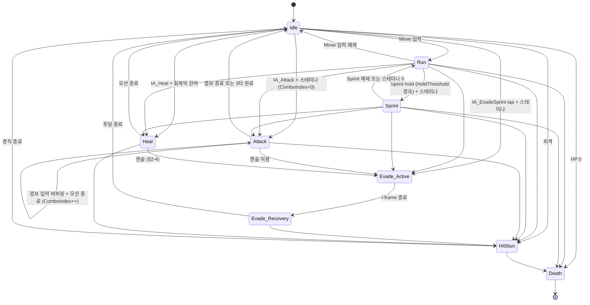

# SKILL_01_COMBAT_SPEC.md — Stage 1 전투 시스템 상세 명세 (v2)

> **문서 우선순위:** `AI_AGENTS_GUIDE.md` §0 대원칙 > `AI_AGENTS_GUIDE.md` §2·§3 > `Design/GAME_DESIGN_PILLARS.md` > 본 문서
> **상태:** P 2차 산출물 — KiHoon 2차 검토 + D 기술 검증 대기
> **작성:** 에이전트 P (Claude Opus 4.7) · 2026-05-29 (v2)
> **부모 문서:** `Design/GAME_DESIGN_PILLARS.md` (조건부 통과 2026-05-29, D 조건 4건 본 명세에 반영, KiHoon 2차 갱신 동기화)
> **다음 산출물:** `Design/SKILL_01B_UNLOCK_SPEC.md` (Stage 1 클리어 후 해금 — 강공격·패링·다운 반응 활용)

본 명세는 Pillars 확정 사항을 단일 기준으로 한다. Pillars와 충돌 시 Pillars가 우선이며, 본 명세는 즉시 수정한다.

---

## 0. 범위 (Scope)

### 0-1. 포함 — Stage 1 시작 가능 액션 (Pillars §7-2, KiHoon 2026-05-29 갱신)

- **기본 이동 (Run)** — Walk 상태 제거, Run 이 default
- **달리기 (Sprint)** — 스테미나 소모, hold 기반
- **약공격 1·2·3타 콤보**
- 회피 (구르기)
- 회복약(에스투스) 사용
- 락온(Lock-on)

### 0-2. 비포함 — 별도 명세 또는 추후

| 항목 | 후속 산출물 |
| :--- | :--- |
| 강공격, 패링, 다운 반응 활용 | `Design/SKILL_01B_UNLOCK_SPEC.md` (Stage 1 클리어 후) |
| 궁극기(불 마법 프로젝타일) | Stage 2 클리어 후 명세 |
| 적 AI 패턴·Boss 로직 | `Design/ENEMY_AI_*` (별도) |
| 피지컬 머티리얼 표면 분기 | Skill 4 (보류 — `AI_AGENTS_GUIDE.md` §4) |

---

## 1. 아키텍처 (Architecture)

### 1-1. 클래스 구조

| 클래스 | 위치 | 본 명세 처리 | 클래스명 비고 |
| :--- | :--- | :--- | :--- |
| `AGKCharacter` | `Source/GK/` (기존) | 본 명세의 핵심 구현 대상 | 확정 |
| `AGKEnemyCharacter` | `Source/GK/` (**신설 — D 권고 #3**) | 최소 골격만 신설 (§8) | **D 확정 2026-05-29** — 명칭 유지 |
| `BP_GKCharacter` | Content (BP) | `AGKCharacter` Child. Data Asset 할당 + 오디오 훅 BP 매핑 (KiHoon 영역) | 확정 |
| `UGKCombatConfig` | `Source/GK/` (**신설**) | Data Asset. 전투 액션 단일 수치 묶음 | **D 확정 2026-05-29** — `UGKPlayerStatsConfig`와 분리 유지 |
| `UGKPlayerStatsConfig` | `Source/GK/` (**신설**) | Data Asset. HP·회복약 묶음 | **D 확정 2026-05-29** — `UGKCombatConfig`와 분리 유지 |
| `DT_ComboAttacks` | Content (Data Table) | **NEW v2.** 콤보별 다행 수치 (Damage·Stamina·Duration·Windows·Montage) | KiHoon 강화 지시 반영 |
| `FGKComboAttackRow` | `Source/GK/` (**신설 struct**) | `FTableRowBase` 파생. DT 행 정의 | **D 확정 2026-05-29** — 명칭 유지 |

**KiHoon 위임 → D 확정 처리 (2026-05-29):** 클래스명·Data Asset 분리/통합 여부 모두 D 기술 검증에서 **P 권장안 그대로 채택**. 책임 분리(Combat / PlayerStats) 가치 인정.

### 1-2. 데이터 저장 계층 (KiHoon 강화 지시 2026-05-29)

**KiHoon 강화 지시:** "수치 같은 변수는 테이블이나 CMS 등으로 조정할 수 있게끔 구현 요청." `AI_AGENTS_GUIDE.md` §3-4 데이터 주도 원칙을 본 명세에서 **엄격 적용**한다. `.cpp` 매직 넘버 0개가 목표.

| 수치 카테고리 | 저장 위치 | 이유 | 본 명세 인스턴스 |
| :--- | :--- | :--- | :--- |
| 캐릭터 자원 (HP, 회복약) | Data Asset | 단일 인스턴스 묶음 | `UGKPlayerStatsConfig` |
| 전투 액션 단일 수치 (이동·회피·HoldThreshold·LockOn·Stamina 글로벌) | Data Asset | 단일 인스턴스 묶음 | `UGKCombatConfig` |
| **콤보별 수치** (Damage, Stamina, Duration, Windows, Montage) | **Data Table** | **다행(콤보 인덱스 0/1/2) 최적, CSV/JSON 임포트로 외부 편집 가능** | `DT_ComboAttacks` |
| 적별 수치 (추후) | Data Table | Stage·종별 다행 | `DT_EnemyStats` (추후) |
| 시간 곡선 (필요 시) | Curve Table | 시간 보간 | (현재 미사용) |

**CMS·외부 도구 연동:** UE Data Table은 CSV·JSON Import/Export를 표준 지원. 디자이너가 Excel·Google Sheets에서 편집 → 임포트로 즉시 반영 가능. 별도 CMS 서버 없이 Data Table 자체가 CMS 역할을 한다.

### 1-3. 상태 머신 — C++ enum 단일 소스

- `enum class EGKCombatState : uint8` — `Source/GK/` 내 신설.
- 상태 머신 로직은 `AGKCharacter` 내 함수로 구현 (단순한 enum + transition fn).
- UE Anim BP State Machine과 **별개**. Anim BP는 이 enum을 `Get*` 함수로 구독하여 애니메이션 분기.

---

## 2. 상태 머신 정의 (State Machine)

### 2-1. 상태 목록 (KiHoon 2026-05-29: Walk 제거, Run 기본화)

| 상태 | 의미 | 이동 입력 처리 | 다른 액션 입력 처리 |
| :--- | :--- | :--- | :--- |
| `Idle` | 정지·기본 | Run으로 전이 | 모두 허용 |
| `Run` | **기본 이동** (이동 입력 시) | 입력 따름 | 모두 허용 |
| `Sprint` | 가속 이동 (Sprint hold + 스테미나) | 입력 따름 | 공격·회피·회복약 허용 (해당 액션 진입 시 Sprint 종료) |
| `Attack` | 약공격 콤보 모션 중 (**ComboIndex 추적**) | 무시 (루트모션 또는 정지) | 다음 콤보 입력 버퍼링 / 회피만 캔슬 허용 |
| `Evade_Active` | 회피 모션, **i-frame ON** | 무시 | 모든 입력 무시 (피격도 막힘) |
| `Evade_Recovery` | 회피 후딜, **i-frame OFF** | 무시 | 모든 액션 입력 무시 |
| `Heal` | 회복약 마시기 (무방비) | 무시 | 회피만 캔슬 허용 (§2-4) |
| `HitStun` | 피격 경직 | 무시 | 모든 입력 무시 |
| `Death` | 사망 | 비활성 | 비활성 |

### 2-2. 콤보 메커니즘 (v2 신설 — KiHoon 2026-05-29 지시)

**핵심 변수 (런타임):**
- `int32 CurrentComboIndex` — 0 / 1 / 2 (1타 / 2타 / 3타). 비전투 시 0.
- `bool ComboInputBuffered` — 콤보 입력 윈도우 내 IA_Attack 추가 입력 여부.

**전이 로직:**
1. **Idle/Run/Sprint** 에서 IA_Attack 입력 + 스테미나 충족 → `Attack` 진입, `CurrentComboIndex = 0`.
2. `Attack` 모션 중 **콤보 입력 윈도우**(`DT_ComboAttacks[CurrentComboIndex].ComboInputWindowStart ~ End`) 내에 IA_Attack 재입력 → `ComboInputBuffered = true`.
3. 현재 콤보 모션 종료 시:
   - `ComboInputBuffered == true && CurrentComboIndex < 2`:
     → `CurrentComboIndex++`, `ComboInputBuffered = false`, 다음 콤보 모션 재생 (`Attack` 유지).
   - 그 외 (입력 없음 또는 3타까지 모두 사용):
     → `Attack` 종료, `Idle` 복귀, `CurrentComboIndex = 0`.
4. **콤보 리셋:** `Attack` 외 상태 진입 시 (Evade·Heal·HitStun·Death) `CurrentComboIndex = 0`.

**스테미나 차감:** 각 콤보 모션 시작 시점에 `DT_ComboAttacks[i].StaminaCost` 차감. 다음 콤보 진입 시점에 잔여 < 다음 콤보 비용이면 콤보 중단(Idle 복귀).

### 2-3. 상태 전이 다이어그램



### 2-4. 캔슬·예외 규칙

| 출발 상태 | 도착 상태 | 허용 | 비고 |
| :--- | :--- | :--- | :--- |
| `Attack` (콤보 N타) | `Attack` (콤보 N+1타) | ✅ | 콤보 입력 윈도우 + 버퍼링. §2-2 참조 |
| `Attack` | `Evade_Active` | ✅ | 다크소울 클래식 패턴. 콤보 캔슬 회피 |
| `Heal` | `Evade_Active` | ✅ | **회복 효과 규칙:** `OnHealItemDrink` 호출 전 캔슬 → 회복 미발효. 호출 후 → 발효(이미 마셨음) |
| `Heal` | `HitStun` | ✅ | 동일 규칙 |
| `Evade_Active` | `HitStun` | ❌ | i-frame이 막음 |
| `Evade_Recovery` | `HitStun` | ✅ | i-frame 종료 후 피격 가능 |
| `Sprint` | `Attack`/`Evade`/`Heal` | ✅ | Sprint 중단 후 해당 액션 진입 |

---

## 3. 자원 모델 — P 권장 수치 (KiHoon 빨간펜 가능)

> ⚠ 모든 수치는 **Data Asset / Data Table** 외부화. `.cpp` 매직 넘버 없음. KiHoon은 에디터·CSV에서 직접 조정 가능.

### 3-1. HP (`UGKPlayerStatsConfig`)

| 항목 | 권장값 | 필드 |
| :--- | :--- | :--- |
| 최대 HP | 100 | `MaxHP` |
| 시작 HP | 100 | Stage 시작 시 풀회복 |

### 3-2. Stamina (`UGKCombatConfig`)

| 항목 | 권장값 | 필드 |
| :--- | :--- | :--- |
| 최대 스테미나 | 100 | `MaxStamina` |
| 회복 속도 | 35 / sec | `StaminaRegenPerSec` — 다크소울식 묵직(느림) |
| 행동 후 회복 지연 | 0.8 s | `StaminaRegenDelay` |
| 회피 소모 | 22 | `Stamina_Evade` |
| Sprint 소모 | 12 / sec | `Stamina_SprintPerSec` |
| 콤보별 소모 | DT 참조 | `DT_ComboAttacks[i].StaminaCost` (§7-3) |

**고갈 시 동작:**
- 잔여 < 다음 액션 소모량인 상태에서 액션 입력 시: 해당 액션 **불발**.
- Sprint 중 0 도달: 자동 Run 복귀.
- 콤보 중 다음 콤보 비용 < 잔여 시: 콤보 중단(Idle).

### 3-3. 회복약 (에스투스, `UGKPlayerStatsConfig`)

| 항목 | 권장값 | 필드 |
| :--- | :--- | :--- |
| Stage 1 시작 횟수 | 3 | `HealItem_StartCount` |
| 1회 회복량 | 50 (절댓값) | `HealItem_HealAmount` — MaxHP=100 기준 50% |
| 사용 모션 시간 | 1.5 s | `HealItem_MotionDuration` |
| 회복 발효 시점 | 모션 시작 후 0.9 s | `HealItem_DrinkTime` — `OnHealItemDrink` 호출 시점 |
| Stage 클리어 시 충전 | 풀충전 | Pillars §3-1 |
| Stage 내 추가 충전 | 없음 | Pillars §3-1 |

### 3-4. 콤보 (`DT_ComboAttacks` — Data Table)

| ComboIndex | Damage | StaminaCost | MotionDuration | HitWindow Start/End | ComboInputWindow Start/End | 비고 |
| :---: | :---: | :---: | :---: | :---: | :---: | :--- |
| 0 (1타) | 25 | 22 | 0.70 s | 0.25 / 0.45 | 0.30 / 0.70 | 가장 빠른 시작 |
| 1 (2타) | 32 | 24 | 0.85 s | 0.35 / 0.55 | 0.40 / 0.85 | 중간 강도 |
| 2 (3타) | 45 | 28 | 1.10 s | 0.50 / 0.75 | — | **콤보 마무리**. 다음 콤보 없음 |

**누적 데미지:** 25 + 32 + 45 = 102. Stage 1 적 HP 권장 100 가정 시 한 콤보 사이클로 정확히 처치.

---

## 4. 입력 매핑 (Enhanced Input — KiHoon 위임 → P 확정 2026-05-29)

### 4-1. Input Action 목록 — 본 명세 사용 IA

> **키 매핑 단일 출처:** `Design/INPUT_MAPPING.md` (2026-05-30 신설). 본 절은 Skill 1 범위에서 사용하는 IA만 나열한다. 키보드·게임패드 바인딩·아셋 위치는 INPUT_MAPPING.md 참조.

| Input Action | 본 명세에서의 용도 |
| :--- | :--- |
| `IA_Move` | 캐릭터 이동 (§5-1) |
| `IA_Look` | 카메라 회전 |
| `IA_EvadeSprint` | 회피(tap, §5-3) + 달리기(hold, §5-1) — 통합 입력. tap/hold 분기 안전장치는 §4-2 |
| `IA_Attack` | 약공격 콤보 1·2·3 (§5-2). 콤보 입력 윈도우 내 재입력 = 콤보 진행 |
| `IA_Heal` | 회복약 사용 (§5-4) |
| `IA_LockOn` | 락온 토글 (§5-5) |

### 4-2. `IA_EvadeSprint` — tap/hold 분기 (D 권고 #2 반영)

#### 4-2-a. HoldThreshold
- `UGKCombatConfig.SprintHoldThreshold = 0.18 s` (P 권장 — 다크소울 클래식 0.15~0.20 범위).
- 단일 수치, Data Asset 노출. 재컴파일 없이 튜닝.

#### 4-2-b. Release 기반 tap 판정
- Press 시 타이머 시작.
- `releaseTime - pressTime < HoldThreshold` → **회피 발동** (tap).
- `releaseTime - pressTime >= HoldThreshold` → 이미 Sprint 진행 중 (hold). Release 시 Run 복귀.
- Press 후 HoldThreshold 경과 순간 → Sprint 진입.

#### 4-2-c. 상호배타 게이트
- 회피 발동 직후: `IA_EvadeSprint` 입력 무시 (회피 모션 종료 = `Evade_Recovery` 종료 시점까지).
- Sprint 중 동일 입력 Release → Run 복귀. **회피로 전환되지 않음.**
- 회피 시도 시 새 Press 사이클 필요.

#### 4-2-d. 의사 코드

```cpp
// On Press
PressTime = GetWorld()->GetTimeSeconds();
EvadeSprintGate = true;
ScheduleSprintCheck(SprintHoldThreshold);

// On Sprint Check (HoldThreshold 경과 시)
if (EvadeSprintGate && IsStillPressed && CanTransitionToSprint())
{
    EnterSprintState();
    EvadeSprintGate = false;
}

// On Release
if (EvadeSprintGate) // tap
{
    if (CanTransitionToEvade())
        EnterEvadeState();
    EvadeSprintGate = false;
}
else // Sprint 진입 후 release
{
    ExitSprintState();
}

// On Evade Recovery End
EvadeSprintInputLocked = false;
```

### 4-3. 입력 우선순위

| 우선순위 | 입력·상태 | 비고 |
| :--- | :--- | :--- |
| 1 | `HitStun` / `Death` | 모든 입력 무시 |
| 2 | `Heal` 모션 진행 중 | 회피만 캔슬(§2-4) |
| 3 | `IA_EvadeSprint` (tap) | 회피 진입 |
| 4 | `IA_Attack` (콤보 입력 또는 신규 콤보) | 콤보 버퍼링 또는 Attack 진입 |
| 5 | `IA_EvadeSprint` (hold) | Sprint 진입 |
| 6 | `IA_Move` | Run |
| - | `IA_LockOn` | 독립 토글 (위 상태와 무관) |

---

## 5. 액션 상세 명세

### 5-1. 이동·달리기 (Run / Sprint)

- **Run (기본 이동):** `MaxWalkSpeed = 450 cm/s` (`UGKCombatConfig.RunSpeed`).
  - 스테미나 소모 **없음**.
  - 이동 입력만으로 즉시 Run 상태.
- **Sprint (가속):** `MaxWalkSpeed = 700 cm/s` (`UGKCombatConfig.SprintSpeed`).
  - 진입 조건: §4-2 hold + `Stamina > 0`.
  - 스테미나 12/sec 지속 소모.
  - 0 도달 시 즉시 Run 복귀.
- **락온 중 이동:** 스트레이프 가능. 캐릭터 회전은 카메라 yaw에 종속.

> KiHoon 갱신 2026-05-29 반영: Walk 상태 제거. 이동 입력 시 즉시 Run.

### 5-2. 약공격 1·2·3 콤보

**전체 흐름 (예시: 3타 모두 입력):**
```
[Idle/Run/Sprint] → IA_Attack 입력
  → [Attack ComboIndex=0] 모션 재생 (0.7s)
      ├ HitWindow 0.25~0.45s: 적 콜리전 → Damage=25
      ├ ComboInputWindow 0.30~0.70s: IA_Attack 재입력 → ComboInputBuffered=true
      └ 모션 종료 시 ComboInputBuffered && Index<2 → 콤보 진행
  → [Attack ComboIndex=1] 모션 재생 (0.85s)
      ├ HitWindow 0.35~0.55s: 적 콜리전 → Damage=32
      ├ ComboInputWindow 0.40~0.85s: 재입력 → ComboInputBuffered=true
      └ 모션 종료 시 콤보 진행
  → [Attack ComboIndex=2] 모션 재생 (1.10s)
      ├ HitWindow 0.50~0.75s: 적 콜리전 → Damage=45
      └ ComboInputWindow 없음 (마지막 타)
  → [Idle] ComboIndex=0 리셋
```

**디테일:**
- **스테미나:** 각 콤보 진입 시점에 즉시 차감 (DT 행 참조). 잔여 부족 시 콤보 중단.
- **캔슬:** 회피만 허용 (§2-4). HitStun으로의 강제 캔슬 가능 (피격).
- **락온 자동 보정:** 각 콤보 모션 시작 직전 캐릭터 yaw를 락온 타겟 방향으로 단발 회전 (모션 도중 추적 없음).
- **데미지 적용:** HitWindow 진입 시 Capsule/Box 트레이스. 적과 overlap 시 첫 1회만 데미지 적용 (재트리거 방지 flag).
- **콤보 리셋 조건:** Attack 외 상태 진입 시 (Evade·Heal·HitStun·Death) ComboIndex=0.

**오디오 훅:** 각 콤보 모션 시작 시 `OnWeaponSwing(ComboIndex)` 호출 (ComboIndex = 0/1/2).
- KiHoon은 Wwise Switch Container로 ComboIndex별 사운드 분기.

**Animation Montage:** `DT_ComboAttacks[i].Montage` 참조 (§7-3).

### 5-3. 회피

- 전체 모션: 1.0 s
  - `Evade_Active`: 0 ~ 0.45 s (i-frame ON)
  - `Evade_Recovery`: 0.45 ~ 1.0 s (i-frame OFF, 행동 불가)
- 이동 방향:
  - 이동 입력 있음 → 입력 방향.
  - 이동 입력 없음 → 후방 스텝(스텝백).
  - 락온 중 + 이동 입력 → 락온 타겟 기준 4방향 스냅(앞/뒤/좌/우).
- 스테미나: 모션 시작 시 즉시 22 차감.
- 오디오 훅:
  - 모션 시작 시 `OnEvadeStart()` 호출
  - `Evade_Recovery` 종료(= Idle 복귀) 시 `OnEvadeEnd()` 호출
- Animation Montage: `UGKCombatConfig.EvadeMontage`.

### 5-4. 회복약 사용

- 모션 시간: 1.5 s
  - 0 ~ 0.4 s: 병 꺼내기
  - 0.4 ~ 0.9 s: 마시기 시작
  - 0.9 s: **회복 발효** (`OnHealItemDrink` 호출 + `HP += HealItem_HealAmount`, MaxHP clamp)
  - 0.9 ~ 1.5 s: 마무리
- 회복약 잔여 1 차감: 모션 시작 시점에 즉시 (캔슬해도 환불 없음 — 다크소울 정합).
- 무방비: 전 구간 피격 시 HitStun으로 캔슬. 0.9s 이전 캔슬 → 회복 효과 미발효.
- 사용 횟수: Stage 시작 시 풀충전. Stage 내 추가 충전 없음(Pillars §3-1).
- 오디오 훅:
  - 0 s: `OnHealItemStart()` 호출
  - 0.9 s: `OnHealItemDrink()` 호출
  - 1.5 s: `OnHealItemComplete()` 호출 (정상 종료 시에만)
- Animation Montage: `UGKPlayerStatsConfig.HealItemMontage`.

### 5-5. 락온 (Lock-on)

- 입력: `IA_LockOn` 토글.
- 거리 한계: 1500 cm (`UGKCombatConfig.LockOnMaxDistance`).
- 시야 한계: 카메라 forward 기준 ±60° (`LockOnFOVDegrees`).
- 한 번에 1체. 거리·시야 이탈 시 자동 해제.
- 락온 대상 후보: `AGKEnemyCharacter` 인스턴스 중 위 조건 만족자.
- 락온 시 카메라: SpringArm `TargetOffset` 약간 후퇴 (예: Z +50, Y +30) — BP에서 튜닝.
- 락온 대상 추적: `AGKEnemyCharacter.LockOnTargetBoneName` 기준.
- 락온 ON/OFF·전환 시 UI 큐 사운드: **본 명세 범위 외** (Wwise 측 자체 매핑 — KiHoon 영역).

---

## 6. 오디오 훅 — 계층·시그니처·타임라인

> KiHoon 위임 2026-05-29 → P 확정. 아래가 최종 시그니처.

### 6-1. 코어 표준 훅 (Pillars §3-3, `AI_AGENTS_GUIDE.md` §3-3)

모든 캐릭터·전투 공통 인터페이스. AGKCharacter에 선언 (기존 유지).

```cpp
UFUNCTION(BlueprintImplementableEvent, Category = "Audio|Movement")
void OnFootstep(EPhysicalSurface SurfaceType);

UFUNCTION(BlueprintImplementableEvent, Category = "Audio|Combat")
void OnWeaponSwing(int32 ComboIndex);

UFUNCTION(BlueprintImplementableEvent, Category = "Audio|Combat")
void OnEvadeStart();

UFUNCTION(BlueprintImplementableEvent, Category = "Audio|Combat")
void OnEvadeEnd();

UFUNCTION(BlueprintImplementableEvent, Category = "Audio|Combat")
void OnHitDamage(FVector HitLocation, AActor* Attacker);
```

**`OnWeaponSwing(ComboIndex)`:** ComboIndex 0/1/2가 각각 1·2·3타에 대응. KiHoon이 Wwise Switch Container로 분기.

### 6-2. Skill 1 확장 훅 — 회복약 전용 (D 조건 #1 분리 승인)

코어 표준과 **계층 분리**. `Category = "Audio|Skill1|Heal"` 접두로 시각 구분. AGKCharacter에 신설.

```cpp
UFUNCTION(BlueprintImplementableEvent, Category = "Audio|Skill1|Heal")
void OnHealItemStart();

UFUNCTION(BlueprintImplementableEvent, Category = "Audio|Skill1|Heal")
void OnHealItemDrink();

UFUNCTION(BlueprintImplementableEvent, Category = "Audio|Skill1|Heal")
void OnHealItemComplete();
```

**P 확정 결정 (KiHoon 위임 2026-05-29):**
- 인자 **없음** — 회복량 등은 Wwise 측에서 별도 처리 불필요(고정 회복 시퀀스).
- Category 접두 `Audio|Skill1|Heal` — Skill별 확장 훅의 표준 명명.

### 6-3. 호출 타임라인 (모션 프레임 기준)

```
[콤보 1타 (ComboIndex=0)]
0.00s ─ OnWeaponSwing(0)
0.25~0.45s ─ HitWindow
0.30~0.70s ─ ComboInputWindow (IA_Attack 버퍼링)
0.70s ─ 모션 종료 → (버퍼링 시) 2타 진입 / (없으면) Idle

[콤보 2타 (ComboIndex=1)]
0.00s ─ OnWeaponSwing(1)
0.35~0.55s ─ HitWindow
0.40~0.85s ─ ComboInputWindow
0.85s ─ 모션 종료 → 3타 진입 / Idle

[콤보 3타 (ComboIndex=2)]
0.00s ─ OnWeaponSwing(2)
0.50~0.75s ─ HitWindow
1.10s ─ 모션 종료 → Idle (콤보 종결, 추가 입력 무시)

[회피]
0.00s ─ OnEvadeStart()
0.00~0.45s ─ Evade_Active (i-frame ON)
0.45s ─ Evade_Recovery 진입
1.00s ─ Evade_Recovery 종료 → OnEvadeEnd() → Idle

[회복약]
0.00s ─ OnHealItemStart()
0.90s ─ OnHealItemDrink() (HP 회복 발효, MaxHP clamp)
1.50s ─ OnHealItemComplete() (정상 종료 시에만)

[발소리]
Run/Sprint 애님 노티 → OnFootstep(SurfaceType) — Skill 4 완료 전까지는 기본값 전달

[피격]
HitStun 진입 시 OnHitDamage(HitLocation, Attacker)
```

---

## 7. Data 저장 정의 (Asset & Table)

### 7-1. `UGKCombatConfig` (UPrimaryDataAsset)

**v2 변경:** 콤보 관련 필드 제거(→ `DT_ComboAttacks`). 그 외 단일 수치만 유지.

```cpp
UCLASS(BlueprintType)
class GK_API UGKCombatConfig : public UPrimaryDataAsset
{
    GENERATED_BODY()

public:
    // Stamina (글로벌)
    UPROPERTY(EditDefaultsOnly, Category = "Stamina") float MaxStamina = 100.f;
    UPROPERTY(EditDefaultsOnly, Category = "Stamina") float StaminaRegenPerSec = 35.f;
    UPROPERTY(EditDefaultsOnly, Category = "Stamina") float StaminaRegenDelay = 0.8f;
    UPROPERTY(EditDefaultsOnly, Category = "Stamina") float Stamina_Evade = 22.f;
    UPROPERTY(EditDefaultsOnly, Category = "Stamina") float Stamina_SprintPerSec = 12.f;

    // Movement
    UPROPERTY(EditDefaultsOnly, Category = "Movement") float RunSpeed = 450.f;
    UPROPERTY(EditDefaultsOnly, Category = "Movement") float SprintSpeed = 700.f;
    UPROPERTY(EditDefaultsOnly, Category = "Movement") float SprintHoldThreshold = 0.18f;

    // Combo — Data Table 참조
    UPROPERTY(EditDefaultsOnly, Category = "Combo") TObjectPtr<UDataTable> ComboAttackTable;

    // Evade
    UPROPERTY(EditDefaultsOnly, Category = "Evade") TObjectPtr<UAnimMontage> EvadeMontage;
    UPROPERTY(EditDefaultsOnly, Category = "Evade") float Evade_TotalDuration = 1.0f;
    UPROPERTY(EditDefaultsOnly, Category = "Evade") float Evade_IFrameDuration = 0.45f;

    // Lock-on
    UPROPERTY(EditDefaultsOnly, Category = "LockOn") float LockOnMaxDistance = 1500.f;
    UPROPERTY(EditDefaultsOnly, Category = "LockOn") float LockOnFOVDegrees = 60.f;
};
```

### 7-2. `UGKPlayerStatsConfig` (UPrimaryDataAsset)

```cpp
UCLASS(BlueprintType)
class GK_API UGKPlayerStatsConfig : public UPrimaryDataAsset
{
    GENERATED_BODY()

public:
    // HP
    UPROPERTY(EditDefaultsOnly, Category = "HP") float MaxHP = 100.f;

    // Heal Item
    UPROPERTY(EditDefaultsOnly, Category = "HealItem") TObjectPtr<UAnimMontage> HealItemMontage;
    UPROPERTY(EditDefaultsOnly, Category = "HealItem") float HealItem_MotionDuration = 1.5f;
    UPROPERTY(EditDefaultsOnly, Category = "HealItem") float HealItem_DrinkTime = 0.9f;
    UPROPERTY(EditDefaultsOnly, Category = "HealItem") float HealItem_HealAmount = 50.f;
    UPROPERTY(EditDefaultsOnly, Category = "HealItem") int32 HealItem_StartCount = 3;
};
```

### 7-3. `DT_ComboAttacks` (Data Table — NEW v2)

**행 구조체:**

```cpp
USTRUCT(BlueprintType)
struct FGKComboAttackRow : public FTableRowBase
{
    GENERATED_BODY()

    UPROPERTY(EditAnywhere) int32 ComboIndex = 0;            // 0/1/2
    UPROPERTY(EditAnywhere) float Damage = 25.f;
    UPROPERTY(EditAnywhere) float StaminaCost = 22.f;
    UPROPERTY(EditAnywhere) float MotionDuration = 0.7f;
    UPROPERTY(EditAnywhere) float HitWindowStart = 0.25f;
    UPROPERTY(EditAnywhere) float HitWindowEnd = 0.45f;
    UPROPERTY(EditAnywhere) float ComboInputWindowStart = 0.30f;
    UPROPERTY(EditAnywhere) float ComboInputWindowEnd = 0.70f; // 0이면 콤보 종결타
    UPROPERTY(EditAnywhere) TObjectPtr<UAnimMontage> Montage;
};
```

**행 정의 (P 권장값):**

| RowName | ComboIndex | Damage | StaminaCost | MotionDuration | Hit Start/End | ComboInput Start/End |
| :--- | :---: | :---: | :---: | :---: | :---: | :---: |
| `Combo_01` | 0 | 25 | 22 | 0.70 | 0.25 / 0.45 | 0.30 / 0.70 |
| `Combo_02` | 1 | 32 | 24 | 0.85 | 0.35 / 0.55 | 0.40 / 0.85 |
| `Combo_03` | 2 | 45 | 28 | 1.10 | 0.50 / 0.75 | 0 / 0 (없음) |

**외부 편집 (CMS 역할):**
- CSV로 Export → Excel/Google Sheets 편집 → Import.
- 디자이너·KiHoon이 재컴파일 없이 콤보 밸런스 즉시 조정.

### 7-4. `AGKCharacter` 슬롯 노출

```cpp
UPROPERTY(EditDefaultsOnly, BlueprintReadOnly, Category = "Combat|Config")
TObjectPtr<UGKCombatConfig> CombatConfig;

UPROPERTY(EditDefaultsOnly, BlueprintReadOnly, Category = "Combat|Config")
TObjectPtr<UGKPlayerStatsConfig> PlayerStatsConfig;
```

`DT_ComboAttacks` 참조는 `CombatConfig.ComboAttackTable`에서 일괄 조회. AGKCharacter는 Config만 노출하면 충분.

---

## 8. AGKEnemyCharacter 최소 골격 (D 권고 #3)

본 명세는 적 AI를 다루지 않지만, AGKCharacter의 락온·피격 인터페이스가 필요로 하는 **최소 골격**만 신설한다.

> 클래스명·구조 세부 사항: **D 확정 2026-05-29** — `AGKEnemyCharacter` 명칭 유지, P 권장 골격 그대로 채택.

### 8-1. 필드 (D 확정 — P 권장 그대로 채택)

| 필드 | 타입 | 비고 |
| :--- | :--- | :--- |
| `MaxHP` | `float` | `EditDefaultsOnly` |
| `CurrentHP` | `float` | 런타임 |
| `AttackPower` | `float` | `EditDefaultsOnly`. 본 명세에서 적이 공격하진 않으나 필드만 정의 |
| `LockOnTargetBoneName` | `FName` | 소켓·본 이름. 기본 `"spine_03"` 또는 `"head"` (아트 수령 후 확정) |
| `LastHitReaction` | `EGKHitReaction` | 휘청/다운/사망 enum 보유 |

### 8-2. enum

```cpp
UENUM(BlueprintType)
enum class EGKHitReaction : uint8
{
    None    UMETA(DisplayName = "None"),
    Sway    UMETA(DisplayName = "Sway"),    // 휘청 (Pillars §6-2 라벨 확정)
    Down    UMETA(DisplayName = "Down"),    // 다운 — Skill 01B에서 활용
    Death   UMETA(DisplayName = "Death"),
};
```

### 8-3. 본 명세에서의 사용

- AGKCharacter의 콤보 hit window 내에 `AGKEnemyCharacter` overlap → `CurrentHP -= DT_ComboAttacks[i].Damage` + `LastHitReaction = Sway`.
- 락온 후보 탐색 시 `AGKEnemyCharacter` 타입만 필터.
- AI 행동·자체 공격은 **본 명세 범위 외**.

---

## 9. 플레이스홀더 전략 (D 권고 #4)

Tier 0·Tier 1 아트가 모두 "요청 전"인 상태에서도 로직·상태·훅·데이터 검증 가능한 형태로 착수.

### 9-1. 플레이스홀더 매핑

| 어셋 | 플레이스홀더 | 비고 |
| :--- | :--- | :--- |
| 캐릭터 본체 메쉬 | `BP_ThirdPersonCharacter` 기본 마네킹 | 기존 임시 에셋 유지 |
| 무기 메쉬 | 엔진 기본 박스 (50×5×5cm) | 손 소켓 `hand_r_socket` 가정 |
| Idle/Run/Sprint | 마네킹 기본 ABP | 그대로 |
| 콤보 1·2·3 몽타주 | 마네킹 기본 펀치 또는 동일 휘두름 3회 (PlayRate 차별) | `DT_ComboAttacks.Montage` 슬롯에 임시 할당. ComboIndex별 사운드는 KiHoon 검증 가능 |
| 회피 몽타주 | 마네킹 기본 구르기 또는 짧은 백스텝 | |
| 회복약 메쉬·아이콘 | 작은 큐브 + 단색 UMG 위젯 | |
| 회복약 마시기 몽타주 | 마네킹 Stand-Pose 1.5s + Wait 노티 | Print String으로 `OnHealItemDrink` 시점 확인 |
| 적 더미 메쉬 | 엔진 박스(180×60×60cm) + Capsule Collision | AGKEnemyCharacter 기본 메쉬 |
| 적 피격·다운·사망 애니 | 정지 + Print String | enum 변경 확인만 |
| HP/스테미나/회복약 UI | UMG `ProgressBar` + `TextBlock` | 아트 톤 미반영 |
| "YOU DIED" 사망 화면 | 검은 페이드 + Text | 페이드 인 1.5s |
| 락온 인디케이터 | 단색 원형 UMG (LockOnTargetBone 화면 좌표) | |

### 9-2. 플레이스홀더로 검증 가능

- ✅ 상태 머신 전이 정확성 (콤보 인덱스 추적 포함)
- ✅ 자원 계산 (HP·스테미나·회복약·콤보별 차감)
- ✅ 입력 처리 (tap/hold, 우선순위, 콤보 버퍼링, 캔슬 규칙)
- ✅ 오디오 훅 호출 시점 (Print String 또는 LogTemp 가시화)
- ✅ Data Asset + Data Table 동작 (CSV Import/Export 검증)
- ✅ 락온 거리·시야 판정
- ✅ GKEditor Win64 Development 빌드 성공

### 9-3. 플레이스홀더로 검증 불가 (아트 수령 후)

- ❌ 애니메이션 정합성·체감
- ❌ 콤보 모션의 시각적 흐름
- ❌ 시각적 만족도·톤
- ❌ Wwise 실제 사운드 매핑(KiHoon이 BlueprintImplementableEvent 매핑 후 검증)

### 9-4. 아트 수령 시 교체 절차

- Data Asset의 `TObjectPtr<UAnimMontage>` 슬롯 교체.
- `DT_ComboAttacks` 행별 Montage 열만 교체 (CSV 재임포트 또는 에디터 직접).
- `.cpp`·`.h` 수정 없음.

---

## 10. 완료 기준 (Definition of Done)

- [ ] `AGKCharacter`에 `EGKCombatState` enum + 상태 전이 함수 구현 (Walk 상태 없음, Run 기본)
- [ ] `AGKCharacter`에 콤보 시스템 구현 — `CurrentComboIndex`, `ComboInputBuffered`, ComboInputWindow 검사, 콤보 모션 전이
- [ ] `AGKCharacter`에 HP·스테미나·회복약 잔여 필드 + 자원 계산 함수 구현
- [ ] `AGKCharacter`에 Skill 1 확장 훅 3종(`OnHealItem*`) 신설 + 코어 표준 5종 유지
- [ ] `AGKEnemyCharacter` 신설 — §8 골격 충족
- [ ] `UGKCombatConfig`·`UGKPlayerStatsConfig` Data Asset C++ 클래스 신설 — §7-1·§7-2 필드 충족
- [ ] `FGKComboAttackRow` struct + `DT_ComboAttacks` 인스턴스 생성 — §7-3 3행 채움
- [ ] `AGKCharacter`에 두 Config 슬롯 `EditDefaultsOnly` 노출
- [ ] `BP_GKCharacter` 생성·`AGKCharacter` Child 설정 (`BP_ThirdPersonCharacter` 정식화)
- [ ] Enhanced Input — `IA_EvadeSprint`의 tap/hold 분기 §4-2 권고 3건 충족
- [ ] §5의 모든 액션이 플레이스홀더 어셋으로 동작 (콤보 1·2·3 모두 검증)
- [ ] §6-3 모든 오디오 훅이 정확한 타임라인 시점에 호출 (LogTemp + Print String)
- [ ] `GKEditor Win64 Development` 빌드 성공 + 런타임 크래시 없음 + LogWwise Error 0
- [ ] `BP_GKCharacter`에서 두 Config Data Asset 할당 + `DT_ComboAttacks` 참조

---

## 11. KiHoon 확인 필요 + 위임 처리 결과

### 11-1. KiHoon 빨간펜 가능 수치 (Data Asset / Data Table에서 즉시 조정)

- [ ] §3-2 스테미나 회복 속도 35/sec
- [ ] §3-2 행동 후 회복 지연 0.8s
- [ ] §3-2 회피 스테미나 22
- [ ] §3-2 Sprint 스테미나 12/sec
- [ ] §3-3 회복약 시작 횟수 3 / 회복량 50 / 발효 시점 0.9s
- [ ] §3-4 콤보 1/2/3 Damage 25/32/45
- [ ] §3-4 콤보 1/2/3 StaminaCost 22/24/28
- [ ] §3-4 콤보 1/2/3 Motion·Hit·ComboInput 윈도우
- [ ] §4-2-a SprintHoldThreshold 0.18s
- [ ] §5-1 Run 450 / Sprint 700 cm/s
- [ ] §5-3 회피 i-frame 0.45s / 후딜 0.55s
- [ ] §5-5 락온 거리 1500cm / 시야 ±60°

### 11-2. KiHoon 위임 → P 확정 (2026-05-29)

- ✅ §4 입력 매핑 전체 — P 권장안 확정
- ✅ §6 오디오 훅 시그니처·인자·Category 접두 — P 권장안 확정
  - `OnHealItem*()` 인자 없음, Category `Audio|Skill1|Heal`

### 11-3. D 위임 → D 확정 처리 (2026-05-29 D 통과)

- ✅ §1-1 `UGKCombatConfig` + `UGKPlayerStatsConfig` **분리 유지** (책임 분리)
- ✅ §1-1 적 베이스 `AGKEnemyCharacter` **명칭 유지**
- ✅ §7-3 struct `FGKComboAttackRow` **명칭 유지**
- D 판정: 기술적으로 타당, 회복약 확장 훅이 기존 AGKCharacter 스켈레톤과 충돌 없음, 플레이스홀더 기반 구현 착수 가능 → **Go**

---

## 12. 후속 산출물 예고

| 산출물 | 범위 | 선행 조건 |
| :--- | :--- | :--- |
| `Design/SKILL_01B_UNLOCK_SPEC.md` | 강공격, 패링, 다운 반응 활용 | 본 명세 구현 완료 + Stage 1 클리어 조건 정의 |
| `Design/ENEMY_AI_*.md` | 적 AI 행동·Stage별 패턴 | AGKEnemyCharacter 골격 검증 |
| `Design/SKILL_01C_*.md` | 궁극기(불 마법 프로젝타일) | Stage 2 클리어 조건 정의 |

---

## 13. 변경 이력

| 일자 | 변경 | 작성자 |
| :--- | :--- | :--- |
| 2026-05-29 | 초안 작성 (v1) — Pillars 확정 + D 조건부 통과 4건 반영 | P |
| 2026-05-29 | v2 — KiHoon 2차 갱신: Walk 상태 제거(Run 기본화), 약공격 1·2·3 콤보 도입, `DT_ComboAttacks` Data Table 신설(데이터 주도 강화), 입력 매핑·오디오 훅 확정, 클래스명 D 위임 처리 | P |
| 2026-05-29 | v2 KiHoon 2차 최종 승인 + D 기술 검증 통과(Go) — §11-1 수치 12건 확정, §11-2 P 위임 확정, §11-3 D 위임 3건 모두 P 권장 그대로 채택 | KiHoon·D 확정 → P 반영 |
